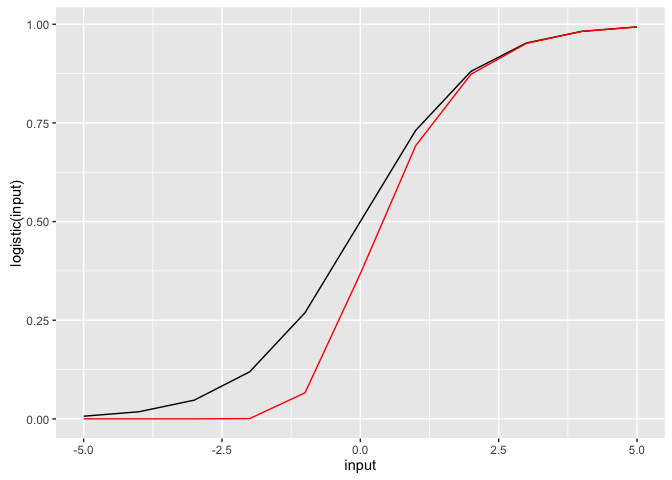

<!-- README.md is generated from README.Rmd. Please edit that file -->
sigmoid
=======

<!--
[](http://www.gnu.org/licenses/gpl-3.0.html)
[](https://cran.r-project.org/package=sigmoid)
[](https://cran.r-project.org/package=sigmoid)
[](https://cran.r-project.org/package=sigmoid)
[](https://travis-ci.org/bquast/sigmoid)
[](https://coveralls.io/r/bquast/sigmoid?branch=master)
-->
Several different sigmoid functions are implemented, including a wrapper function, SoftMax preprocessing and inverse functions.

Installation
------------

The **stable** version can be installed from [CRAN](https://cran.r-project.org/package=sigmoid) using:

``` r
install.packages('sigmoid')
```

The **development** version, to be used **at your peril**, can be installed from [GitHub](http://github.com/bquast/sigmoid) using the `devtools` package.

``` r
if (!require('devtools')) install.packages('devtools')
devtools::install_github('bquast/sigmoid')
```

Usage
-----

Following installation, the package can be loaded using:

The `sigmoid()` function returns the sigmoid value of the input(s), by default this is done using the **standard logistic function**.

``` r
library(sigmoid)
sigmoid(3)
#> [1] 0.9525741
```

Inputs can also be tensors, such as vectors, matrices, or arrays.

``` r
sigmoid(-5:5)
#>  [1] 0.006692851 0.017986210 0.047425873 0.119202922 0.268941421
#>  [6] 0.500000000 0.731058579 0.880797078 0.952574127 0.982013790
#> [11] 0.993307149
sigmoid( matrix(-3:5,nrow=3) ) # etc.
#>            [,1]      [,2]      [,3]
#> [1,] 0.04742587 0.5000000 0.9525741
#> [2,] 0.11920292 0.7310586 0.9820138
#> [3,] 0.26894142 0.8807971 0.9933071
```

The `sigmoid()` function is a wrapper, which by default uses the `logistic()` function, it can also use other methods.

``` r
sigmoid( -5:5, method='Gompertz' )
#>  [1] 3.507389e-65 1.942338e-24 1.892179e-09 6.179790e-04 6.598804e-02
#>  [6] 3.678794e-01 6.922006e-01 8.734230e-01 9.514320e-01 9.818511e-01
#> [11] 9.932847e-01
```

These functions can also be accessed directly.

``` r
logistic(1:5)
#> [1] 0.7310586 0.8807971 0.9525741 0.9820138 0.9933071
Gompertz(-1:-5)
#> [1] 6.598804e-02 6.179790e-04 1.892179e-09 1.942338e-24 3.507389e-65
```

These mappings are similar but not identical.

``` r
library(ggplot2)

input = -5:5

df = data.frame(input, logistic(input), Gompertz(input))

ggplot(df, aes(input, logistic(input))) + geom_line() +
  geom_line(aes(input,Gompertz(input)), colour='red')
```



For inverses, additional parameters, SoftMax, etc. see the vignette.

    vignette('sigmoid')

For general information on using the package, please refer to the help files.

``` r
help('sigmoid')
help(package='sigmoid')
```

Additional Information
----------------------

An overview of the changes is available in the NEWS file.

``` r
news(package='sigmoid')
```

There is a dedicated website with information hosted on my [personal website](http://qua.st/).

<http://qua.st/sigmoid>

Development
-----------

Development takes place on the GitHub page.

<http://github.com/bquast/sigmoid>

Bugs can be filed on the issues page on GitHub.

<https://github.com/bquast/sigmoid/issues>
